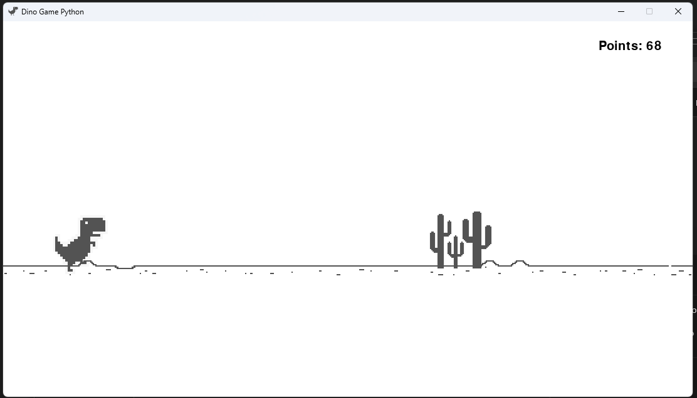
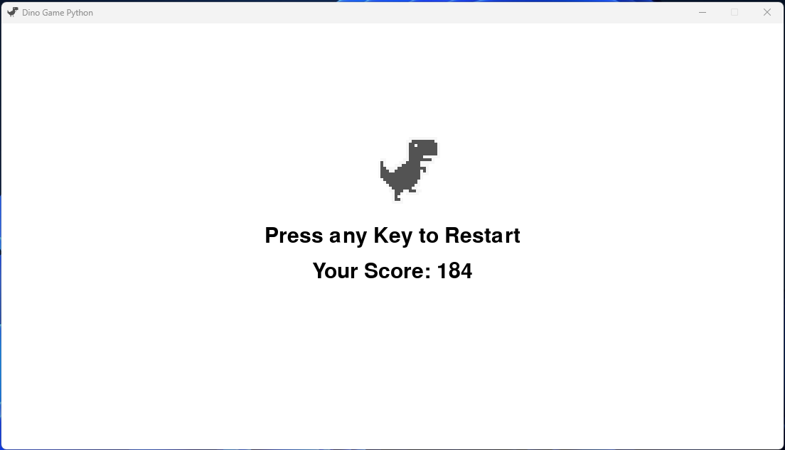

# 🦖 Dino Game - Python & Pygame

A modern and efficient remake of the classic Chrome Dino Game, developed in Python with Pygame.

## 📸 Preview





## 🚀 Technologies Used

- Python 🐍
- Pygame 🎮

## 📂 Project Structure

```
📦 DinoGame
├── 📂 assets           # Game images and sounds
├── 📂 docs             # Screenshots and documentation
├── 📂 src              # Main source code
│   ├── 📂 classes          # Classes
│   │   ├── cloudy.py               # Cloudy logic
│   │   ├── dino.py                 # Dino logic
│   │   ├── obstacles.py            # Obstacles logic
│   ├── 📂 controllers      # Controllers
│   │   ├── game.py                 # Game logic
│   │   ├── menu.py                 # Menu code
│   ├── game_config.py      # Configs
├── README.md           # This file
├── main.py             # Main script
└── requirements.dat # Dependencies
```

## 🎮 How to Play

1. Clone the repository:
   ```bash
   git clone https://github.com/denisdss/Dino-Game-Python.git
   ```
2. Navigate to the project folder:
   ```bash
   cd Dino-Game-Python
   ```
3. Install dependencies:
   ```bash
   pip install -r requirements.dat
   ```
4. Run the game:
   ```bash
   python main.py
   ```

## 🏆 Features

✅ Smooth and optimized graphics <br>
✅ Modular and scalable code structure <br>
✅ Dynamic sounds and animations <br>
✅ Easy installation and execution <br>

## 🤝 Contribution

Feel free to contribute! Fork the repository, implement improvements, and submit a pull request. Any feedback is also welcome. 🚀

## 📜 License

This project is licensed under the MIT License.

## 📬 Contact

Denis DSS - Software Engineer
[[denisdss@outlook.com](mailto\:denisdss@outlook.com)]

## ☕ Pay me a Coffee

Ethereum Network: 0x0F8D4366ff23ee657B8aC5713C4E1591976C46c2

PIX Brazilian Network: fc6efbb0-287c-498c-b4aa-e5c70578d6ab

Paypal Donation: https://www.paypal.com/donate/?business=P2HRRJZ3YZWHW&currency_code=USD

Buy me a coffee APP: http\://buymeacoffee.com/denisdss